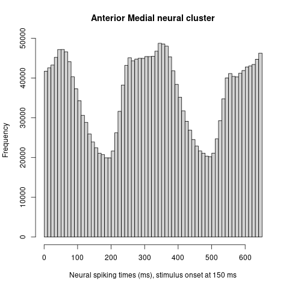
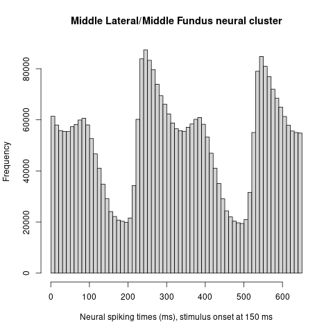

#  Exploratory Data Analysis of Neural Spike Data for Facial Identity

Raymond T Melton, 06-30-2024

## Doing a Post-Stimulus Histogram on Neural Spike Data

We will simply look at  post-stimulus histograms for the neuron spiking times in the data from the paper,
*The Code for Facial Identity in the Primate Brain,* 
Le Chang and Doris Y. Tsao, 2017.
The histograms show both **expected** and **unexpected results,** as explained below.  

I chose to do post-stimulus histograms because I thought it would give a suitably big picture as to what the data looked like.  Also because no similar histograms appeared in the paper.

## Description of the Data

In their experiment, some visual stimuli were presented to a couple of macaque monkeys, and consequent neural spikes were recorded from two areas of the monkeys' inferotemporal cortex:
Namely, the 
*middle lateral/middle fundus*
and the 
*anterior medial.*
A total of 2000 stimuli were presented, and 650 millisecond long recordings were taken from about 100 neurons from each of the two areas. The stimuli were comprised of human faces.
The recordings indicate whether there was a neural spike or not during any given millisecond.

The data will not be reproduced here, at the paper authors' request. The data is made available by contacting the papers' authors. At note about this in the Follow-up.

## The Histograms Themselves  

The histograms below represent the number of neural spikes counted during each millisecond following a stimulus presentation. The histograms were generated using R's hist() function.

## Expected Result vs Unexpected Result  

When the stimulus is a human face, and the neural spikes are recorded from the inferotemporal cortex of the macaque, the time between stimulus presentation and neuron spiking is typically about 100 milliseconds. The stimulus presentation time in each histogram is at 150 ms.

* **Expected result:** A normal, or Gaussian, curve centered around 250 ms. And we do find a mode at 250 ms.
By *mode,* I mean *little hump in the graph.*
* **Unexpected result:** The histograms are bimodal.  That is, there is a second mode, centered at around 360 ms for the anterior medial neurons, and at around 380 ms for the middle lateral/middle fundus neurons.
I have no good explanation for the second mode.

## Questions Generated by this Analysis

1. Do the modes come from one neural sub-population firing twice?
2. Or two sub-populations firing once?

These two questions are something that a data analyst should be able to answer.

## Follow-Up

In a future addendum here, we will look at the overlap of the collections of neurons contributing to each node in the histograms.

It also wouldn't hurt to contact the authors of the paper and get their insight into the bimodal thing. I suppose.

Finally, Bayesian statistics is generative. We might be able to simulate the data that produced the histograms in the first place, if we can produce a decent model.
